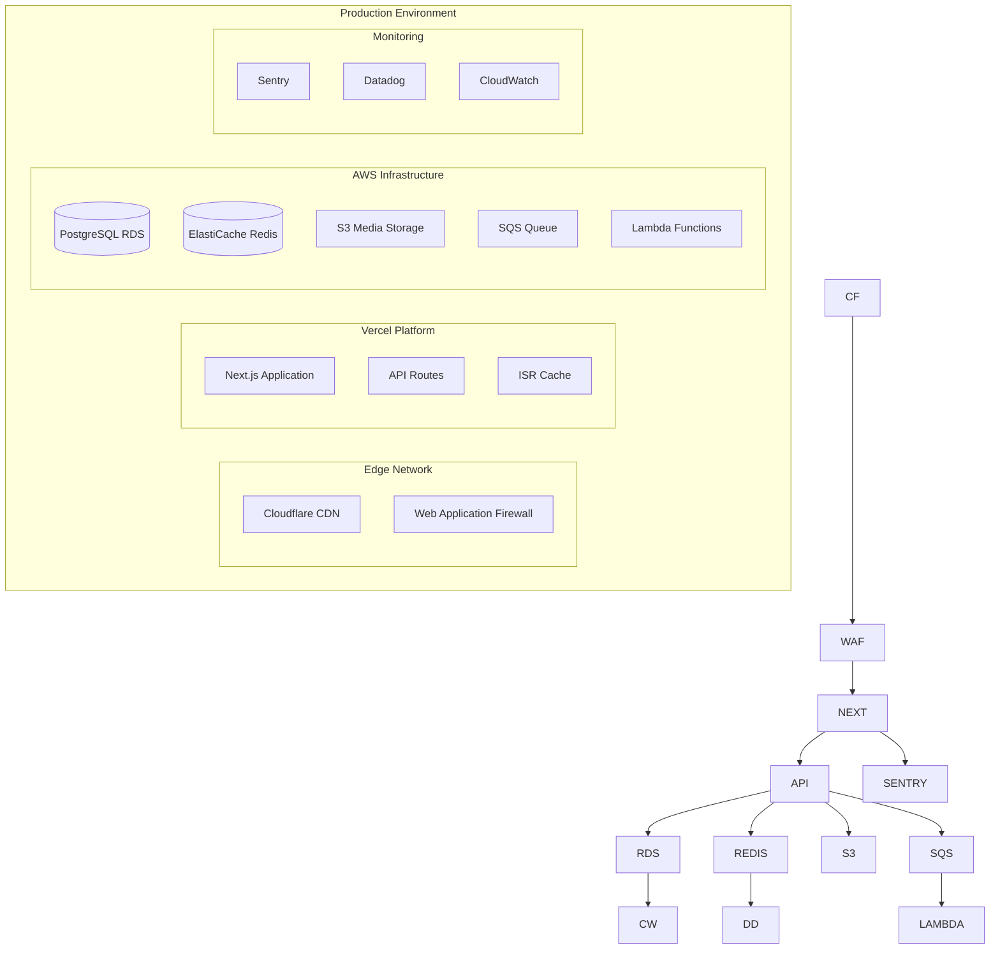

# 12\. Deployment Architecture

## LLM Implementation Notes

Deployment is optimized for serverless with fallback to containerized deployment. Use environment variables for all configuration.

## Infrastructure Overview



## Environment Configuration

```bash