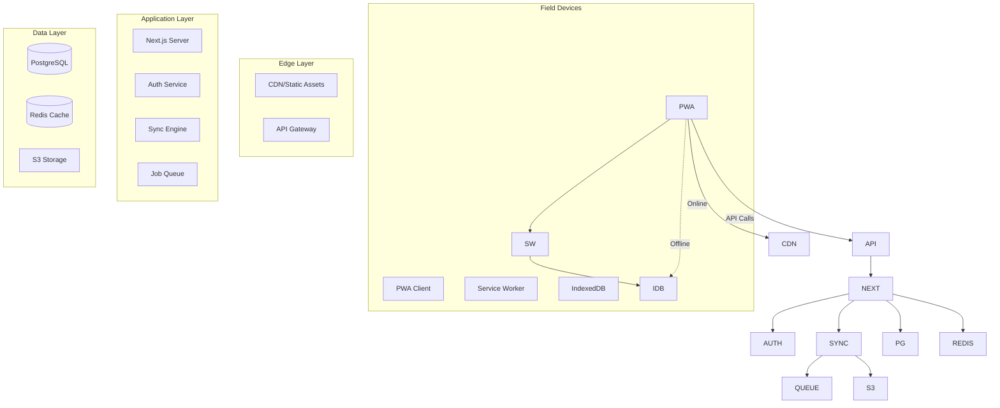

# 3\. High-Level Architecture

## System Architecture Diagram

## Architectural Layers

### 1\. Presentation Layer (PWA Client)

* **Responsibility**: User interface, offline operation, local data management
* **Technologies**: Next.js, React, Zustand, IndexedDB
* **Key Features**: Offline forms, GPS integration, media capture, sync queue

### 2\. Service Worker Layer

* **Responsibility**: Network interception, cache management, background sync
* **Technologies**: Workbox, next-pwa
* **Key Features**: Offline fallback, sync retry, cache strategies

### 3\. Application Layer

* **Responsibility**: Business logic, authentication, API endpoints
* **Technologies**: Next.js API Routes, NextAuth.js, Prisma
* **Key Features**: Role-based access, verification workflows, data validation

### 4\. Synchronization Layer

* **Responsibility**: Conflict resolution, queue processing, data reconciliation
* **Technologies**: Custom sync engine, BullMQ, PostgreSQL
* **Key Features**: Priority sync, conflict detection, automatic retry

### 5\. Data Layer

* **Responsibility**: Data persistence, caching, file storage
* **Technologies**: PostgreSQL, Redis, S3
* **Key Features**: ACID compliance, audit trails, media management

---
