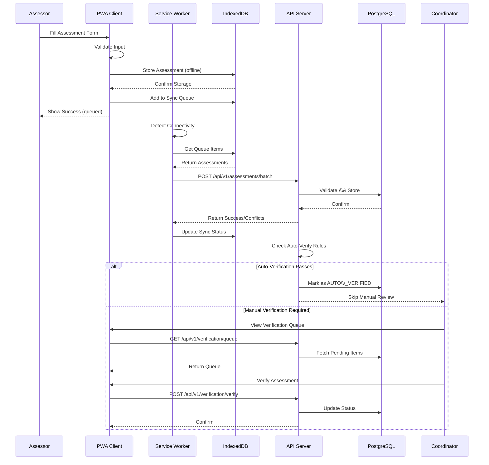
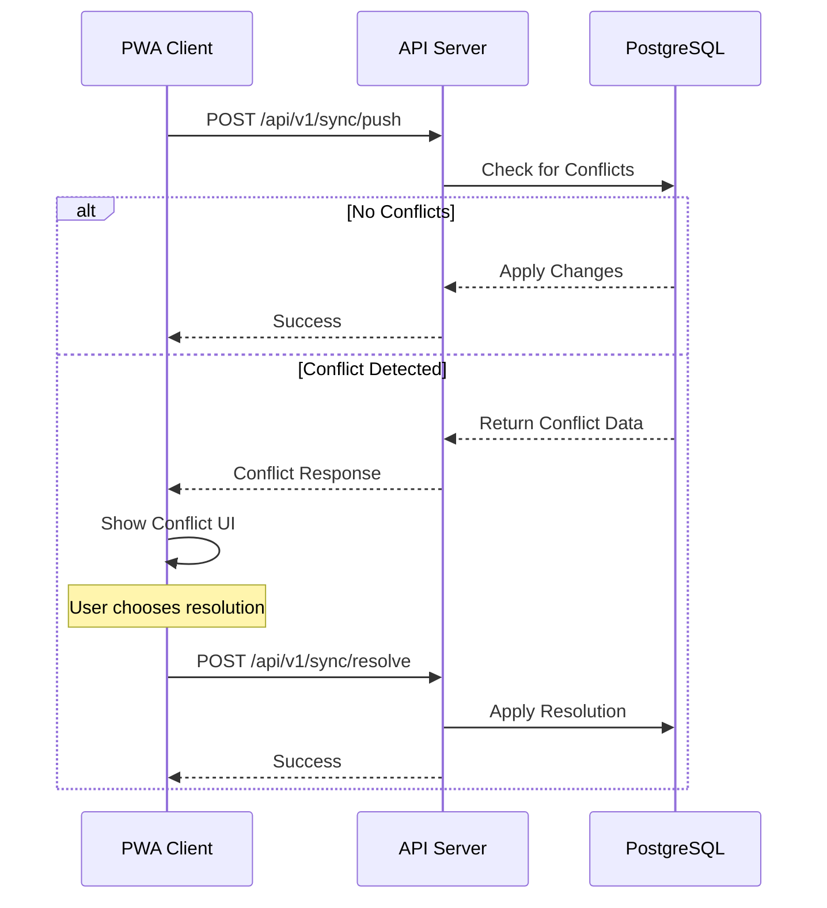
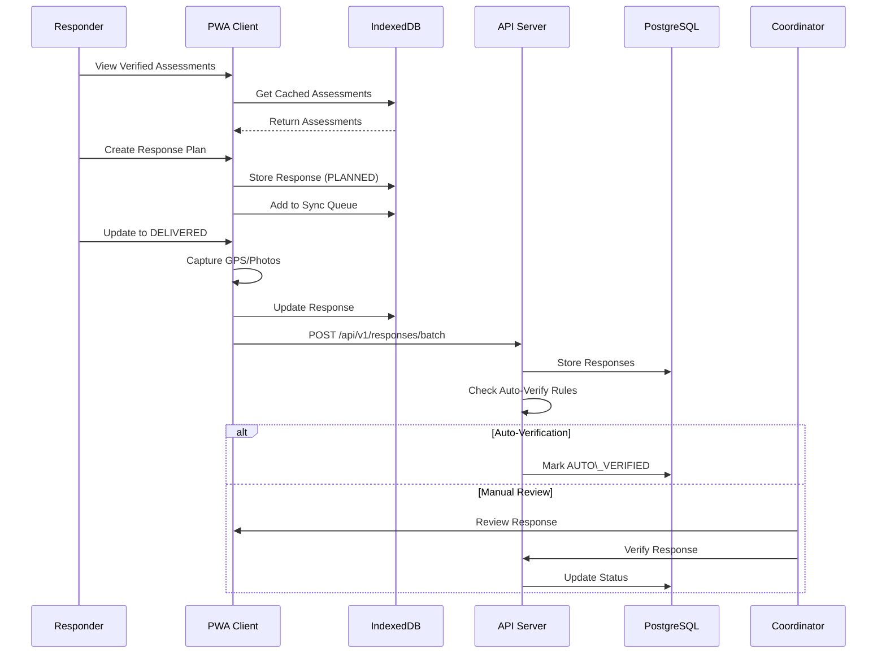
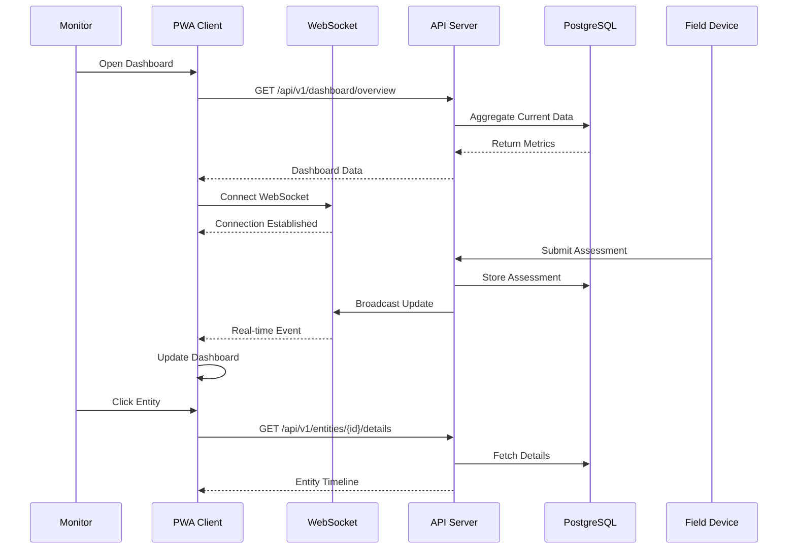
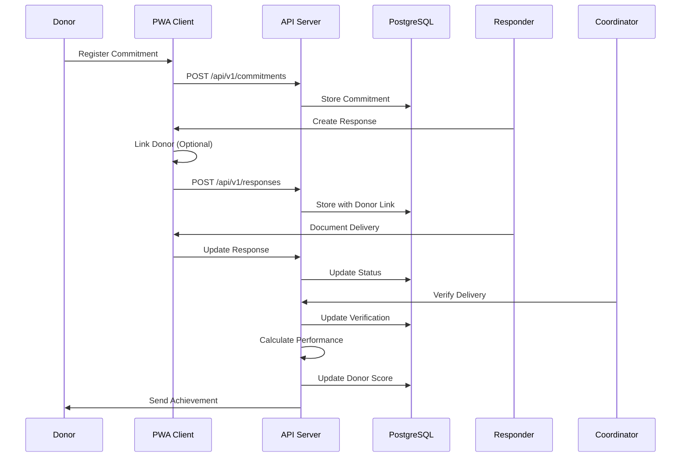

# 7\. Sequence Diagrams

## LLM Development Notes

These sequences represent the exact flow that must be implemented. Each step includes error handling and offline fallbacks.

## Critical User Workflow: Offline Assessment to Verification

## Sync Conflict Resolution Flow

## Response Planning to Delivery Workflow

## Real-time Monitoring Dashboard Flow

## Donor Commitment to Verification Flow

---
