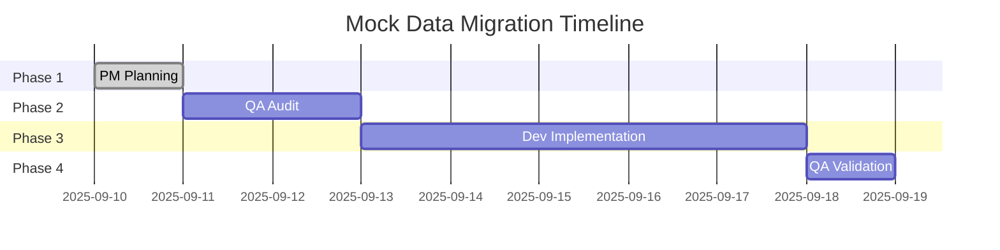

# Mock Data Migration Plan
**Project:** DMS v2 BMad - Frontend Mock Data to Backend Migration  
**Created:** 2025-09-10  
**PM Agent:** John  
**Epic Ref:** Post Epic 10 Enhancement

## 🎯 **MISSION CRITICAL**
Migrate all remaining frontend hardcoded mock data to backend/database sources to ensure integration-ready testing and consistent data flow across the application.

## 📋 **PROJECT OVERVIEW**

### **Current State Analysis**
Based on Epic 10 validation results:
- ✅ 189 API endpoints connected to real backend
- ✅ Major infrastructure components using backend data
- ⚠️ Some frontend components may still contain hardcoded mocks
- ⚠️ Potential violations of CLAUDE.md mock data guidelines

### **Target State**
- ✅ All frontend components fetch data from API endpoints
- ✅ Mock data centralized in backend/database for dev environment
- ✅ Integration-ready testing approach throughout
- ✅ Full compliance with CLAUDE.md guidelines

## 🔄 **FOUR-PHASE EXECUTION PLAN**

### **Phase 1: PM Coordination & Planning** 📋
**Agent:** PM (John)  
**Duration:** 1 day  
**Status:** ✅ COMPLETED

**Deliverables:**
- [x] Migration plan document (this file)
- [x] QA agent audit instructions
- [x] Dev agent implementation instructions
- [x] Success criteria definition
- [x] Timeline and coordination framework

---

### **Phase 2: QA Agent Comprehensive Audit** 🔍
**Agent:** QA (Quinn)  
**Duration:** 1-2 days  
**Instructions:** See `01-qa-audit-instructions.md`

**Deliverables:**
- [ ] Complete inventory of frontend mock data locations
- [ ] CLAUDE.md guideline compliance assessment
- [ ] Backend API coverage gap analysis
- [ ] Priority-ranked migration task list
- [ ] Risk assessment for each component

---

### **Phase 3: Dev Agent Implementation** 💻
**Agent:** Dev  
**Duration:** 3-5 days (based on audit findings)  
**Instructions:** See `02-dev-implementation-instructions.md`

**Deliverables:**
- [ ] Frontend components updated to use API endpoints
- [ ] New backend mock endpoints created where needed
- [ ] Data fetching patterns standardized
- [ ] Integration tests passing
- [ ] TypeScript compilation successful

---

### **Phase 4: QA Agent Final Validation** ✅
**Agent:** QA (Quinn)  
**Duration:** 1 day  
**Instructions:** See `03-qa-validation-instructions.md`

**Deliverables:**
- [ ] Verification all components use backend data sources
- [ ] Integration testing validation
- [ ] CLAUDE.md compliance confirmation
- [ ] Performance impact assessment
- [ ] Migration completion report

## 📊 **SUCCESS CRITERIA**

### **Primary Objectives**
1. **Zero Frontend Mock Data** - No hardcoded mock values in React components
2. **API-First Architecture** - All components fetch data via API endpoints
3. **Integration Ready** - Tests can switch between mock and real data by changing API endpoints
4. **Performance Maintained** - No degradation in load times or responsiveness

### **Quality Gates**
- [ ] TypeScript compilation passes without mock-related errors
- [ ] All existing functionality preserved
- [ ] Test suites continue passing
- [ ] Development server startup time maintained (< 10 seconds)
- [ ] Build process completes successfully

## ⚠️ **RISK MITIGATION**

### **High Risk Items**
- **Component Breaking Changes** - Mitigation: Incremental component-by-component migration
- **API Performance Impact** - Mitigation: Monitor dev server response times during migration  
- **Test Suite Failures** - Mitigation: Run test validation after each component migration

### **Rollback Strategy**
- Git branch-based development with frequent commits
- Component-level rollback capability
- Automated test validation before each merge

## 📈 **TIMELINE**



**Total Duration:** 7-9 days  
**Critical Path:** QA Audit → Dev Implementation → QA Validation

## 🤝 **AGENT COORDINATION**

### **Handoff Protocol**
1. **PM → QA**: Migration plan + audit instructions
2. **QA → Dev**: Audit report + prioritized task list
3. **Dev → QA**: Completed implementation + test results
4. **QA → PM**: Final validation report + completion confirmation

### **Communication Requirements**
- Daily progress updates in project chat
- Blocker escalation within 4 hours
- Completed deliverables shared immediately
- Success criteria validation at each phase gate

## 📁 **DOCUMENTATION STRUCTURE**

```
docs/qa/dev-mock-migration/
├── 00-migration-plan.md              # This file
├── 01-qa-audit-instructions.md       # QA agent specific instructions
├── 02-dev-implementation-instructions.md # Dev agent specific instructions
├── 03-qa-validation-instructions.md  # Final QA validation instructions
├── audit-results/                    # QA audit outputs
│   ├── frontend-mock-inventory.md
│   ├── api-coverage-gaps.md
│   └── priority-task-list.md
├── implementation-log/               # Dev implementation tracking
│   ├── component-migration-log.md
│   ├── api-endpoint-changes.md
│   └── test-validation-results.md
└── final-report/                    # Project completion
    ├── migration-completion-report.md
    └── performance-impact-analysis.md
```

## 🎯 **NEXT STEPS**

1. **Immediate:** QA agent reviews `01-qa-audit-instructions.md`
2. **Next:** Execute Phase 2 comprehensive audit
3. **Following:** Dev agent implementation based on audit findings
4. **Final:** QA validation and project completion

---

**Status:** Phase 1 Complete ✅ | Ready for QA Agent Audit Phase ⏳  
**Last Updated:** 2025-09-10 by PM John