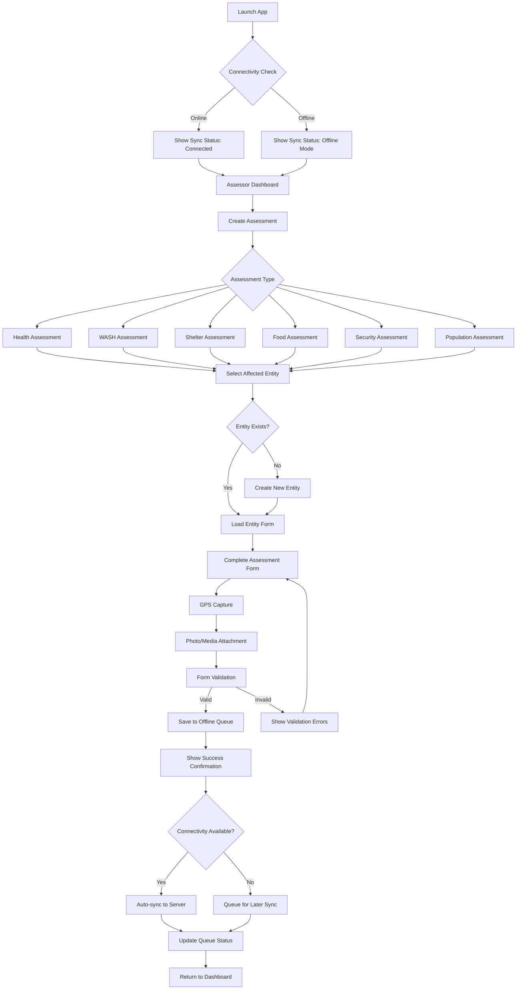
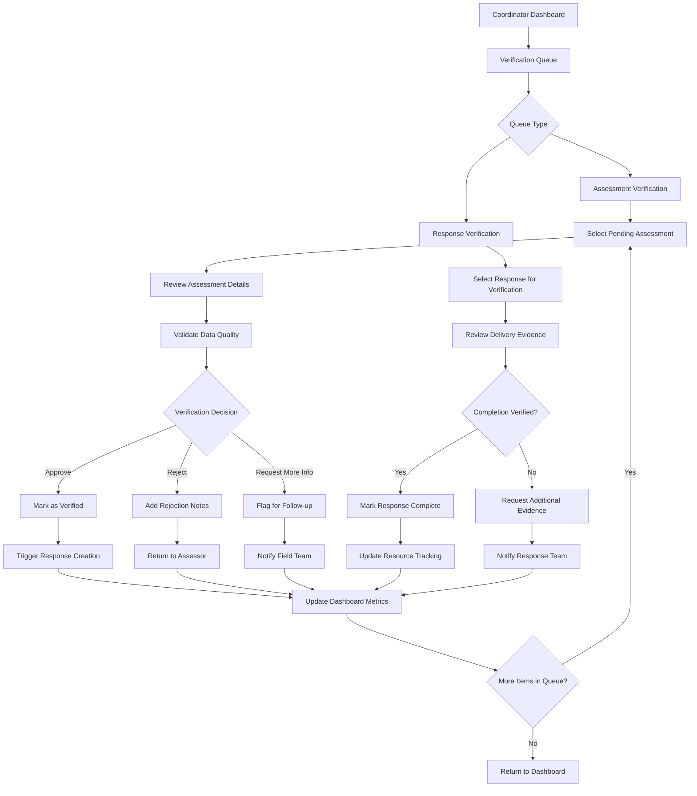
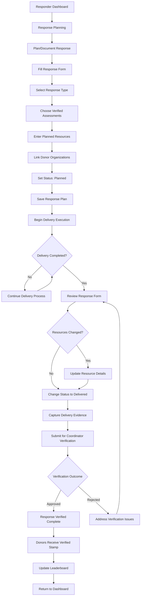

# Disaster Management PWA UI/UX Specification

## Document Metadata
- **Template:** Frontend Spec Template v2.0
- **Output:** docs/front-end-spec.md
- **Mode:** Interactive (with advanced elicitation)
- **Status:** In Progress

---

## Introduction

This document defines the user experience goals, information architecture, user flows, and visual design specifications for Disaster Management PWA's user interface. It serves as the foundation for visual design and frontend development, ensuring a cohesive and user-centered experience optimized for challenging field conditions in Borno State, Nigeria.

### Project Context
Based on your comprehensive PRD, this PWA serves critical humanitarian coordination needs with:
- **Primary Users:** Assessors, Responders, Coordinators, and Donors
- **Core Workflow:** Assessment → Coordination → Response → Coordination
- **Key Constraint:** Offline-first operation in challenging connectivity environments
- **Success Metrics:** Zero data loss, <3s load times, 100% offline functionality

---

## Overall UX Goals & Principles

### Target User Personas

**1. Field Assessors (Primary)**
- **Context:** Remote areas with unreliable connectivity, time-critical assessments
- **Needs:** Reliable data capture, GPS integration, offline queue management
- **Pain Points:** Data loss during handoffs, complex validation, connectivity gaps
- **Device:** Mid-range Android devices with limited battery life

**2. Crisis Coordinators** 
- **Context:** Central command centers managing multiple incidents simultaneously
- **Needs:** Real-time verification, queue management, bottleneck prevention
- **Pain Points:** Verification delays, lack of situational awareness, overwhelmed workflows
- **Device:** Desktop/tablet with consistent internet connectivity

**3. Field Responders**
- **Context:** Resource delivery in challenging environments
- **Needs:** Response planning, delivery tracking, donor attribution
- **Pain Points:** Planning inefficiencies, manual tracking, resource coordination
- **Device:** Mobile devices with intermittent connectivity

**4. Donor Organizations**
- **Context:** Resource commitment and delivery oversight
- **Needs:** Transparent tracking, performance visibility, competitive engagement
- **Pain Points:** Lack of delivery transparency, no engagement mechanisms
- **Device:** Various devices, primarily web-based access

### Usability Goals

1. **Immediate Productive Use:** New field workers can complete their first assessment within 5 minutes of app access
2. **Offline Resilience:** 100% core functionality available without connectivity, with clear sync status indicators
3. **Rapid Data Entry:** Optimized forms allowing assessors to complete evaluations in under 10 minutes per location
4. **Zero Data Loss:** Robust offline queuing with visual confirmation of successful submissions
5. **Contextual Clarity:** Clear role-based interfaces preventing confusion between assessment/response modes

### Design Principles

1. **Offline-First Clarity** - Always show connection status and sync queue state
2. **Progressive Disclosure** - Show only essential information per user role and context
3. **Immediate Feedback** - Every action provides instant visual/tactile confirmation
4. **Fail-Safe Operations** - Prevent data loss through optimistic UI and robust queuing
5. **Cultural Sensitivity** - Design for Nigerian users with appropriate language and conventions

---

## Information Architecture (IA)

### Site Map / Screen Inventory

```mermaid
graph TD
    A[App Launch] --> B{Role Selection}
    B --> C[Assessor Dashboard]
    B --> D[Coordinator Dashboard] 
    B --> E[Responder Dashboard]
    B --> F[Donor Dashboard]
    
    C --> C1[Create Assessment]
    C --> C2[Assessment Queue]
    C --> C3[Affected Entity Management]
    C --> C4[Sync Status]
    
    C1 --> C1a[Preliminary Assessment]
    C1 --> C1b[Rapid Assessment - Health]
    C1 --> C1c[Rapid Assessment - WASH]
    C1 --> C1d[Rapid Assessment - Shelter]
    C1 --> C1e[Rapid Assessment - Food]
    C1 --> C1f[Rapid Assessment - Security]
    C1 --> C1g[Rapid Assessment - Population]
    
    C2 --> C2a[Response Review]
    
    D --> D1[Verification Queue]
    D --> D2[Response Queue]
    D --> D3[Crisis Dashboard]
    D --> D4[Resource Overview]
    D --> D5[System Monitoring]
    
    E --> E1[Response Planning]
    E --> E2[Active Responses]
    E --> E3[Delivery Tracking]
    E --> E4[Assessment Review]
    
    F --> F1[Donation Planning]
    F --> F2[Commitment Tracking]
    F --> F3[Delivery Monitoring]
    F --> F4[Performance Leaderboard]
    
    C3 --> C3a[Camps & Communities]
    
    D1 --> D1a[Assessment Verification]
    D1 --> D1b[Response Verification]
    
    E1 --> E1a[Plan Response]
    E1 --> E1b[Convert to Delivery]
```



### Navigation Structure

**Primary Navigation:** Collapsible sidebar with role-based sections
- **Sidebar Benefits:** 
  - Maximizes content area when collapsed (critical for mobile/field use)
  - Always accessible via hamburger menu
  - Can show notifications/badges for pending items
  - Supports role switching without losing context

**Role-Based Sidebar Sections:**
- **Assessor:** Create Assessment | Queue & Reviews | Affected Entities | Sync Status
- **Coordinator:** Verification Queues | Crisis Dashboard | Resource Overview | System Monitoring  
- **Responder:** Response Planning | Active Responses | Delivery Tracking | Assessment Reviews
- **Donor:** Donation Planning | Commitment Tracking | Delivery Monitoring | Performance Leaderboard

**Secondary Navigation:** Contextual filtering within each section
- **Assessment Type Selection:** Quick access tiles for 6 assessment types (Health, WASH, Shelter, Food, Security, Population)
- **Queue Filtering:** Status-based filters (pending sync, failed, completed, under review)
- **Affected Entity Filtering:** Toggle between viewing Camps vs Communities within the same interface
- **Time Period Selection:** Date range controls for dashboard views

**Entity Type Clarification:**
"Entity type switching" refers to filtering the Affected Entity Management interface to show either:
- **Camps:** Formal displacement sites with structured management
- **Communities:** Existing villages/neighborhoods affected by disasters
Both are "Affected Entities" in your data model, but field workers need to quickly switch context between these two distinct location types when conducting assessments or planning responses.

**Breadcrumb Strategy:** 
- **Assessment Flow:** Dashboard > Assessment Type > Affected Entity > Form Completion > Review & Submit
- **Coordination Flow:** Dashboard > Queue Type > Individual Item > Verification Action > Status Update
- **Response Flow:** Dashboard > Response Planning > Response Creation > Delivery Execution > Completion Verification

---

## User Flows

### Critical Assessment Flow
**User Goal:** Field assessor completes rapid assessment for affected entity during connectivity outage

**Entry Points:** App launch → Role selection → Assessor dashboard → Create Assessment

**Success Criteria:** Assessment data captured offline, queued for sync, assessor receives confirmation



**Edge Cases & Error Handling:**
- **GPS unavailable:** Allow manual location entry with warning indicator
- **Storage full:** Alert user, suggest syncing completed assessments to free space
- **Form corruption:** Auto-save draft every 30 seconds, recovery on app restart
- **Entity selection error:** Provide search and "create new" fallback options
- **Media attachment failure:** Continue without media, flag for later addition

**Notes:** This flow prioritizes data integrity over connectivity, ensuring field workers never lose assessment progress even in worst-case scenarios.

### Coordinator Verification Flow
**User Goal:** Crisis coordinator verifies pending assessments and approves responses efficiently

**Entry Points:** Coordinator dashboard → Verification Queue

**Success Criteria:** Assessment verified, response triggered or flagged, bottlenecks prevented



**Edge Cases & Error Handling:**
- **Overwhelmed queue:** Auto-verification system for routine assessments/responses meeting configured quality thresholds
- **Assessment conflicts:** Side-by-side comparison tool for duplicate entity assessments
- **Unclear evidence:** Direct communication channel to field teams for clarification
- **Auto-verification errors:** Manual review queue for flagged auto-verified items
- **System downtime:** Offline verification capability with batch sync when restored

### Response Planning & Delivery Flow
**User Goal:** Responder plans and documents resource delivery with proper verification for donor recognition

**Entry Points:** Responder dashboard → Response Planning

**Success Criteria:** Response planned, delivery documented, coordinator verification enables donor recognition



**Note:** Response Type field filters which verified assessments are available for selection (e.g., Health responses can only link to Health assessments).

**Edge Cases & Error Handling:**
- **Assessment unavailable:** Form validation prevents submission without valid assessment link
- **Donor linking optional:** Response can proceed without donor attribution
- **Resource changes during delivery:** Easy form editing before status change to "delivered"
- **Evidence capture failure:** Multiple evidence types with fallback options
- **Verification delays:** Clear status tracking shows responses pending coordinator review

**Key Workflow Clarification:**
- **"Planned" Status:** Response documented in anticipation of delivery, allows for resource planning outside the system
- **"Delivered" Status:** Triggers coordinator verification process and potential donor recognition
- **Resource Management:** System tracks delivered resources for accountability, not resource allocation planning
- **Donor Recognition:** Verified stamps and leaderboard updates only occur after coordinator verification

---

## Wireframes & Interface Requirements

### Key Interface Patterns

**Offline-First Status Indicators**
- **Connection Status Badge:** Always visible in header (Green: Online, Orange: Syncing, Red: Offline)
- **Sync Queue Counter:** Shows pending items with expandable details
- **Form Save States:** Auto-save indicators with last saved timestamp
- **Data Integrity Warnings:** Clear alerts when offline data conflicts arise

**Role-Based Interface Adaptation**
- **Collapsible Sidebar:** Role-specific navigation with notification badges
- **Role Switching:** Dropdown/toggle in header showing current role with option to switch for multi-role users
- **Context Preservation:** Role switching maintains current work context (e.g., partially completed forms)
- **Role Permissions:** Interface elements adapt based on user's assigned role permissions
- **Context-Sensitive Headers:** Show current role, location (if available), and key status indicators
- **Quick Action Buttons:** Role-appropriate primary actions always accessible
- **Emergency Escalation:** Rapid access to priority workflows for crisis situations

### Critical Screen Specifications

#### Assessor: Assessment Form Interface
**Layout Requirements:**
- **Single-Column Form:** Optimized for mobile portrait orientation
- **Progressive Disclosure:** Show only relevant fields based on assessment type selection
- **GPS Integration:** Automatic location capture with manual override option
- **Media Attachment:** One-tap photo/video capture with offline storage
- **Auto-Save:** Persistent draft saving every 30 seconds with visual confirmation

**Form Validation Strategy:**
- **Real-Time Validation:** Immediate feedback on field completion
- **Offline Validation:** Client-side validation that works without connectivity
- **Required Field Indicators:** Clear visual hierarchy for mandatory vs optional fields
- **Error Recovery:** Preserved data on validation failures with clear correction guidance

#### Coordinator: Verification Dashboard
**Layout Requirements:**
- **Split-Pane Design:** Queue list on left, details pane on right (desktop/tablet)
- **Mobile Accordion:** Collapsible queue items with expandable details (mobile)
- **Batch Actions:** Multi-select capabilities for efficient queue processing
- **Quick Filters:** One-tap filtering by assessment type, urgency, status
- **Auto-Verification Controls:** Toggle switches for auto-approval by assessment/response type with configurable criteria
- **Performance Metrics:** Real-time dashboard showing verification rates, auto-verification statistics, and bottlenecks

**Auto-Verification Configuration:**
- **Assessment Type Rules:** Set auto-approval criteria for each assessment type (Health, WASH, Shelter, Food, Security, Population)
- **Response Type Rules:** Configure auto-verification thresholds for different response categories
- **Quality Thresholds:** Define minimum data quality scores for auto-approval eligibility
- **Override Controls:** Manual review option for auto-verified items if needed
- **Audit Trail:** Complete logging of auto-verification decisions for accountability

**Verification Interface:**
- **Side-by-Side Comparison:** Assessment data alongside verification checklist
- **Evidence Gallery:** Integrated photo/media viewer with zoom capabilities
- **One-Click Actions:** Approve, reject, or request more info with minimal steps
- **Auto-Verification Status:** Clear indicators showing which items were auto-verified vs manually reviewed
- **Bulk Processing:** Template responses for common verification scenarios

#### Responder: Response Form Interface
**Layout Requirements:**
- **Guided Workflow:** Step-by-step form completion with progress indicator
- **Assessment Link Section:** Searchable/filterable verified assessments based on Response Type
- **Resource Documentation:** Flexible input for diverse resource types and quantities
- **Donor Attribution:** Optional donor linking with search/selection interface
- **Status Management:** Clear visual distinction between "Planned" and "Delivered" modes

**Delivery Documentation:**
- **Evidence Capture:** Multi-media evidence collection (photos, GPS, beneficiary count)
- **Flexible Editing:** Easy modification of planned response before marking as delivered
- **Delivery Timeline:** Visual progress tracking from planning through verification

#### Donor: Performance Dashboard
**Layout Requirements:**
- **Leaderboard Prominence:** Gamified performance display with clear rankings
- **Commitment Tracking:** Visual progress from commitment to verified delivery
- **Impact Visualization:** Maps and charts showing delivery locations and impact metrics
- **Transparency Reports:** Detailed delivery evidence and beneficiary feedback

### Mobile-First Design Specifications

**Touch Targets:**
- **Minimum Size:** 44px touch targets for all interactive elements
- **Spacing:** 8px minimum spacing between touch targets
- **Thumb-Friendly:** Primary actions positioned for easy thumb access

**Connectivity Handling:**
- **Offline Indicators:** Consistent visual language for offline/sync states
- **Progressive Enhancement:** Core functionality available offline, enhanced features online
- **Sync Feedback:** Clear progress indicators for data synchronization

**Performance Optimization:**
- **Lazy Loading:** Load assessment forms and media content on demand
- **Image Compression:** Automatic compression for media attachments
- **Local Storage:** Efficient offline data management with storage usage indicators

**Field Operation Considerations:**
- **High Contrast:** Readable in bright outdoor lighting conditions
- **Simplified Navigation:** Reduced cognitive load for field workers under pressure
- **Battery Awareness:** Minimal background processing to preserve device battery life

---

## Visual Design & Technical Requirements

### Design System Specifications

**Color Palette (Humanitarian Context)**
- **Primary:** Emergency Red (#DC2626) - For urgent actions, alerts, critical assessments
- **Secondary:** UN Blue (#0066CC) - For coordinator actions, verified items, system status
- **Success:** Relief Green (#059669) - For completed responses, successful syncs, approved items
- **Warning:** Attention Orange (#D97706) - For pending items, sync issues, draft states
- **Neutral:** Slate Gray (#64748B) - For general UI, text, secondary information
- **Background:** Clean White (#FFFFFF) with Light Gray (#F8FAFC) for sections

**Status Indication Colors:**
- **Offline Mode:** Orange gradient background indicator
- **Sync Success:** Green pulse animation
- **Failed Sync:** Red border with retry button
- **Auto-Verified:** Blue checkmark badge
- **Manual Review Required:** Orange exclamation badge

**Typography & Accessibility**
- **Primary Font:** System fonts for optimal mobile performance (SF Pro, Roboto, Segoe UI)
- **Font Sizes:** Minimum 16px for body text (outdoor readability), 14px minimum for labels
- **Font Weights:** Regular (400) for body, Semibold (600) for headers, Bold (700) for alerts
- **Contrast Ratios:** Minimum WCAG AA compliance (4.5:1) for all text combinations
- **Dyslexia Support:** High contrast mode toggle, OpenDyslexic font option

**Spacing & Layout**
- **Base Unit:** 8px spacing grid for consistent alignment
- **Touch Targets:** 44px minimum for mobile interaction
- **Content Width:** Maximum 600px for optimal reading, responsive breakpoints at 768px, 1024px
- **Safe Areas:** Respect mobile device safe areas (notches, navigation bars)

### PWA Technical Requirements

**Performance Specifications**
- **Initial Load:** <3 seconds on 3G networks as specified in PRD
- **Offline Forms:** <1 second form access from cache
- **Image Optimization:** WebP format with fallbacks, automatic compression to <500KB
- **Bundle Size:** Target <2MB total app size for initial download
- **Memory Usage:** <150MB peak usage on mid-range Android devices

**Offline-First Architecture**
- **Service Worker:** Background sync, cache management, offline form handling
- **Local Storage:** IndexedDB for form data, assessments, media files
- **Sync Strategy:** Optimistic UI updates with rollback on sync failures
- **Conflict Resolution:** Last-write-wins with manual resolution for critical conflicts
- **Data Compression:** GZIP compression for API responses, local data optimization

**Security Requirements**
- **Data Encryption:** AES-256 encryption for locally stored sensitive data
- **Authentication:** JWT tokens with refresh mechanism, biometric authentication support
- **API Security:** HTTPS only, request signing, rate limiting protection
- **Privacy:** GDPR-compliant data handling, user consent management
- **Audit Trails:** Complete activity logging for all verification and response actions

**Device Compatibility**
- **Android:** Minimum Android 7.0 (API level 24), Chrome 90+
- **iOS:** Minimum iOS 12, Safari 14+
- **Desktop:** Chrome 90+, Firefox 88+, Safari 14+, Edge 90+
- **Screen Sizes:** Responsive design supporting 320px to 2560px width
- **Hardware:** GPS support required, camera optional with fallback

### Form Design Specifications

**Assessment Form Requirements**
- **Progressive Disclosure:** Show fields based on assessment type selection
- **Smart Defaults:** Pre-populate location, timestamp, assessor information
- **Validation Strategy:** Real-time validation with clear error messaging
- **Auto-Save:** Every 30 seconds with visual confirmation and manual save option
- **Media Integration:** One-tap camera access, multiple photo support, GPS embedding

**Response Form Requirements**
- **Assessment Linking:** Searchable dropdown filtered by Response Type
- **Resource Documentation:** Flexible quantity/type inputs with predefined common items
- **Donor Attribution:** Optional searchable donor selection with "Add New" capability
- **Status Management:** Clear visual distinction between Planned/Delivered states
- **Evidence Capture:** Multiple evidence types (photos, GPS coordinates, beneficiary signatures)

**Coordinator Interface Requirements**
- **Queue Management:** Sortable, filterable lists with bulk action capabilities
- **Evidence Review:** Integrated media viewer with zoom, rotation, metadata display
- **Auto-Verification:** Configuration panels for approval rules and thresholds
- **Performance Dashboard:** Real-time metrics with drill-down capabilities
- **Communication Tools:** Direct messaging to field teams for clarification requests

### Accessibility & Inclusion Requirements

**Field Worker Accommodations**
- **Low Literacy Support:** Icon-heavy navigation, voice input options, simplified language
- **Multi-Language:** Support for English, Hausa, Kanuri (primary languages in Borno State)
- **Cultural Sensitivity:** Appropriate imagery, respectful terminology for displaced populations
- **Training Integration:** In-app tutorials, help overlays, contextual guidance

**Technical Accessibility**
- **Screen Reader:** Full ARIA support, semantic HTML structure
- **Motor Impairments:** Large touch targets, voice navigation, switch control support
- **Visual Impairments:** High contrast themes, font size controls, color blind friendly palette
- **Cognitive Support:** Clear navigation, consistent patterns, undo functionality

---

## Component Library Specifications (LLM Development Patterns)

### Core UI Patterns for Humanitarian Context

**Status Badge Components:**
```typescript
// Assessment Status Badges
<Badge variant={status === 'verified' ? 'success' : status === 'auto_verified' ? 'secondary' : 'warning'}>
  {status === 'verified' && <CheckCircle className="w-3 h-3 mr-1" />}
  {status === 'auto_verified' && <Bot className="w-3 h-3 mr-1" />}
  {status === 'pending' && <Clock className="w-3 h-3 mr-1" />}
  {statusText}
</Badge>

// Response Status Badges  
<Badge variant={status === 'delivered' ? 'success' : 'outline'}>
  {status === 'planned' ? 'Planned' : 'Delivered'}
</Badge>

// Verification Type Indicators
<Badge variant="secondary" className="bg-blue-100 text-blue-800">
  <Bot className="w-3 h-3 mr-1" />
  Auto-Verified
</Badge>
```

**Offline Queue Item Pattern:**
```typescript
// Standard offline queue item
<Card className="border-l-4 border-l-orange-500"> {/* Orange = offline queued */}
  <CardHeader className="pb-2">
    <div className="flex justify-between items-start">
      <CardTitle className="text-sm">Assessment #{assessmentId}</CardTitle>
      <Badge variant="warning">Queued</Badge>
    </div>
  </CardHeader>
  <CardContent>
    <p className="text-xs text-muted-foreground">
      Last saved: {formatDistanceToNow(lastSaved)} ago
    </p>
    <div className="flex gap-2 mt-2">
      <Button size="sm" variant="outline">Edit</Button>
      <Button size="sm" variant="outline">Priority</Button>
    </div>
  </CardContent>
</Card>
```

**Role Switching Component:**
```typescript
// Header role switcher with context preservation
<DropdownMenu>
  <DropdownMenuTrigger asChild>
    <Button variant="outline" className="flex items-center gap-2">
      <User className="w-4 h-4" />
      {currentRole}
      <ChevronDown className="w-4 h-4" />
    </Button>
  </DropdownMenuTrigger>
  <DropdownMenuContent>
    {userRoles.map(role => (
      <DropdownMenuItem key={role} onClick={() => switchRole(role)}>
        <div className="flex items-center gap-2">
          {getRoleIcon(role)}
          {role}
          {pendingCounts[role] > 0 && (
            <Badge variant="secondary" className="ml-auto">
              {pendingCounts[role]}
            </Badge>
          )}
        </div>
      </DropdownMenuItem>
    ))}
  </DropdownMenuContent>
</DropdownMenu>
```

**Assessment Type Selection Grid:**
```typescript
// 6 assessment types in responsive grid
<div className="grid grid-cols-2 md:grid-cols-3 gap-3">
  {assessmentTypes.map(type => (
    <Card key={type.id} className="cursor-pointer hover:shadow-md transition-shadow">
      <CardContent className="p-4 text-center">
        <div className="mb-2">{type.icon}</div>
        <h3 className="font-medium text-sm">{type.name}</h3>
        <p className="text-xs text-muted-foreground mt-1">
          {getPendingCount(type.id)} pending
        </p>
      </CardContent>
    </Card>
  ))}
</div>
```

**Entity Type Filter:**
```typescript
// Toggle between Camps and Communities
<div className="flex border rounded-lg p-1">
  <Button 
    variant={entityType === 'camps' ? 'default' : 'ghost'} 
    size="sm" 
    onClick={() => setEntityType('camps')}
    className="flex-1"
  >
    <Tent className="w-4 h-4 mr-2" />
    Camps ({campCount})
  </Button>
  <Button 
    variant={entityType === 'communities' ? 'default' : 'ghost'} 
    size="sm" 
    onClick={() => setEntityType('communities')}
    className="flex-1"
  >
    <Home className="w-4 h-4 mr-2" />
    Communities ({communityCount})
  </Button>
</div>
```

**Auto-Verification Controls:**
```typescript
// Coordinator auto-verification settings
<Card>
  <CardHeader>
    <CardTitle className="flex items-center gap-2">
      <Settings className="w-4 h-4" />
      Auto-Verification Rules
    </CardTitle>
  </CardHeader>
  <CardContent>
    {assessmentTypes.map(type => (
      <div key={type} className="flex items-center justify-between py-2">
        <Label>{type} Assessments</Label>
        <div className="flex items-center gap-2">
          <Switch 
            checked={autoVerifyRules[type]?.enabled} 
            onCheckedChange={(enabled) => updateRule(type, enabled)}
          />
          {autoVerifyRules[type]?.enabled && (
            <Select value={autoVerifyRules[type]?.threshold}>
              <SelectTrigger className="w-20">
                <SelectValue />
              </SelectTrigger>
              <SelectContent>
                <SelectItem value="high">High</SelectItem>
                <SelectItem value="medium">Medium</SelectItem>
                <SelectItem value="low">Low</SelectItem>
              </SelectContent>
            </Select>
          )}
        </div>
      </div>
    ))}
  </CardContent>
</Card>
```

---

## Error States & Edge Cases UI (LLM Critical Patterns)

### Network & Connectivity States

**Connection Status Header:**
```typescript
// Always visible connection indicator
<div className="flex items-center gap-2 px-3 py-1 bg-muted/50">
  {isOnline ? (
    <div className="flex items-center gap-1">
      <div className="w-2 h-2 bg-green-500 rounded-full" />
      <span className="text-xs">Online</span>
    </div>
  ) : (
    <div className="flex items-center gap-1">
      <div className="w-2 h-2 bg-orange-500 rounded-full animate-pulse" />
      <span className="text-xs">Offline Mode</span>
      {syncQueue.length > 0 && (
        <Badge variant="secondary" className="ml-2">
          {syncQueue.length} queued
        </Badge>
      )}
    </div>
  )}
</div>
```

**Offline Mode Alert:**
```typescript
// Persistent offline indicator
{isOffline && (
  <Alert className="border-orange-500 bg-orange-50">
    <Wifi className="h-4 w-4" />
    <AlertTitle>Offline Mode</AlertTitle>
    <AlertDescription>
      Your work is being saved locally. {syncQueue.length} items will sync when connected.
    </AlertDescription>
  </Alert>
)}
```

### Form Validation States

**Required Field Validation:**
```typescript
// Standard field validation pattern
<div className="space-y-2">
  <Label htmlFor="gpsLocation">
    GPS Location <span className="text-red-500">*</span>
  </Label>
  <div className="flex gap-2">
    <Input 
      id="gpsLocation"
      value={gpsLocation}
      onChange={(e) => setGpsLocation(e.target.value)}
      className={errors.gpsLocation ? "border-red-500" : ""}
      placeholder="Auto-detecting..."
    />
    <Button type="button" size="sm" variant="outline">
      <MapPin className="w-4 h-4" />
    </Button>
  </div>
  {errors.gpsLocation && (
    <p className="text-sm text-red-500 flex items-center gap-1">
      <AlertCircle className="w-4 h-4" />
      {errors.gpsLocation}
    </p>
  )}
</div>
```

**GPS/Location Error States:**
```typescript
// GPS unavailable fallback
{gpsError && (
  <Alert variant="destructive">
    <AlertTriangle className="h-4 w-4" />
    <AlertTitle>GPS Unavailable</AlertTitle>
    <AlertDescription>
      Location services are disabled. Please enable GPS or enter coordinates manually.
      <Button variant="outline" size="sm" className="mt-2">
        Enter Manually
      </Button>
    </AlertDescription>
  </Alert>
)}
```

### Loading & Processing States

**Form Save States:**
```typescript
// Auto-save indicator
<div className="flex items-center gap-2 text-xs text-muted-foreground">
  {isSaving ? (
    <>
      <Loader2 className="w-3 h-3 animate-spin" />
      Saving...
    </>
  ) : (
    <>
      <Check className="w-3 h-3 text-green-500" />
      Saved {formatDistanceToNow(lastSaved)} ago
    </>
  )}
</div>
```

**Sync Processing States:**
```typescript
// Queue sync progress
{isSyncing && (
  <Card className="border-blue-500">
    <CardContent className="pt-4">
      <div className="flex items-center gap-3">
        <Loader2 className="w-4 h-4 animate-spin text-blue-500" />
        <div className="flex-1">
          <p className="text-sm font-medium">Syncing {syncProgress.current} of {syncProgress.total}</p>
          <Progress value={(syncProgress.current / syncProgress.total) * 100} className="mt-1" />
        </div>
      </div>
    </CardContent>
  </Card>
)}
```

### Empty States

**No Data Patterns:**
```typescript
// Empty assessment queue
{assessments.length === 0 && (
  <Card className="text-center py-8">
    <CardContent>
      <FileX className="w-12 h-12 mx-auto text-muted-foreground mb-3" />
      <h3 className="font-medium mb-2">No assessments yet</h3>
      <p className="text-sm text-muted-foreground mb-4">
        Create your first assessment to get started
      </p>
      <Button>
        <Plus className="w-4 h-4 mr-2" />
        Create Assessment
      </Button>
    </CardContent>
  </Card>
)}

// Empty verification queue
{verificationQueue.length === 0 && (
  <Card className="text-center py-8">
    <CardContent>
      <CheckCircle className="w-12 h-12 mx-auto text-green-500 mb-3" />
      <h3 className="font-medium mb-2">All caught up!</h3>
      <p className="text-sm text-muted-foreground">
        No assessments pending verification
      </p>
    </CardContent>
  </Card>
)}
```

### Critical Error Handling

**Data Loss Prevention:**
```typescript
// Unsaved changes warning
{hasUnsavedChanges && (
  <Alert className="border-amber-500 bg-amber-50">
    <AlertTriangle className="h-4 w-4" />
    <AlertTitle>Unsaved Changes</AlertTitle>
    <AlertDescription>
      You have unsaved changes that will be lost if you leave this page.
      <div className="flex gap-2 mt-2">
        <Button size="sm" onClick={saveChanges}>Save Now</Button>
        <Button size="sm" variant="outline" onClick={discardChanges}>Discard</Button>
      </div>
    </AlertDescription>
  </Alert>
)}
```

**Storage Full Warning:**
```typescript
// Device storage limit
{storageWarning && (
  <Alert variant="destructive">
    <HardDrive className="h-4 w-4" />
    <AlertTitle>Storage Almost Full</AlertTitle>
    <AlertDescription>
      Device storage is {storageUsed}% full. Sync pending items to free space.
      <Button size="sm" className="mt-2" onClick={forceSyncOldest}>
        Sync Oldest Items
      </Button>
    </AlertDescription>
  </Alert>
)}
```

---

## Implementation Priorities & Development Guidance

### Phase 1: Core Offline Foundation (Months 1-2)
**Critical Path Requirements:**
- **Next.js PWA Setup:** Configure next-pwa plugin with Workbox for offline-first architecture
- **Prisma Database Schema:** Implement type-safe database models based on DMS Data Model v3.0
- **Shadcn/ui Component System:** Set up design system with humanitarian color palette
- **Assessment Form System:** All 6 assessment types with full offline capability using Zustand state
- **Local Data Management:** IndexedDB with Dexie.js wrapper for offline storage and encryption
- **Basic Role System:** Role switching interface with context preservation using NextAuth.js
- **GPS & Media Integration:** Location capture and photo attachment with offline storage

**Success Criteria:** Field assessors can complete and queue assessments entirely offline

**Technical Deliverables:**
- **Database Schema:** Complete Prisma schema with all entities (Incident, Assessment, Response, AffectedEntity)
- **Component Library:** Shadcn/ui components customized for humanitarian workflows
- **Offline Infrastructure:** Service worker with background sync and cache management
- **Type-Safe APIs:** Next.js API routes with Prisma integration for all CRUD operations

### Phase 2: Workflow Management (Months 3-4)
**Coordinator Capabilities:**
- **Verification Dashboard:** Manual verification with batch processing
- **Auto-Verification System:** Configurable rules and quality thresholds
- **Queue Management:** Filtering, sorting, and bulk actions
- **Communication Tools:** Direct messaging to field teams

**Response Documentation:**
- **Response Form System:** Status-based workflow (Planned → Delivered)
- **Assessment Linking:** Response Type filtering and verified assessment selection
- **Donor Attribution:** Optional donor linking and recognition system
- **Evidence Capture:** Multi-media delivery documentation

**Success Criteria:** Complete Assessment → Coordination → Response → Coordination workflow operational

### Phase 3: Performance & Engagement (Months 5-6)
**Dashboard Systems:**
- **Crisis Management Dashboard:** Real-time operational overview for coordinators
- **Monitoring Dashboard:** Situational awareness with geographic visualization
- **Donor Performance Dashboard:** Leaderboards and impact tracking
- **System Analytics:** Performance metrics and bottleneck identification

**Advanced Features:**
- **Smart Sync System:** Priority-based synchronization with conflict resolution
- **Advanced Auto-Verification:** Machine learning enhancement for quality assessment
- **Mobile Optimization:** Enhanced PWA features and push notifications
- **Multi-Language Support:** Localization for Borno State languages

### Frontend Development Standards

**Recommended Tech Stack (LLM-Optimized):**
```typescript
// Optimal stack for LLM implementation and disaster management requirements
Framework: Next.js 14 (App Router)
State Management: Zustand
UI Library: Shadcn/ui + Tailwind CSS
Database Client: Prisma (type-safe DB operations)
Authentication: NextAuth.js
PWA Support: next-pwa plugin
Offline Storage: IndexedDB with Dexie.js wrapper
Service Worker: Workbox (via next-pwa)
```

**LLM Implementation Benefits:**
- **Next.js 14:** File-based routing and App Router patterns are highly predictable for LLMs
- **Shadcn/ui:** Copy-paste component implementations with consistent patterns
- **Zustand:** Minimal boilerplate with predictable state update patterns
- **Prisma:** Auto-generated TypeScript types prevent database-related errors
- **Extensive Training Data:** All components have massive documentation for LLM reference

**Code Organization:**
```
src/
├── app/                 # Next.js 14 App Router
│   ├── (dashboard)/    # Route groups for role-based layouts
│   ├── assessor/       # Assessor-specific pages
│   ├── coordinator/    # Coordinator-specific pages
│   ├── responder/      # Responder-specific pages
│   ├── donor/          # Donor-specific pages
│   └── api/            # API routes for backend integration
├── components/
│   ├── ui/             # Shadcn/ui components
│   ├── forms/          # Assessment and response forms
│   ├── dashboards/     # Role-specific dashboards
│   └── offline/        # Offline-specific components
├── lib/
│   ├── stores/         # Zustand state management
│   ├── db.ts           # Prisma client configuration
│   ├── auth.ts         # NextAuth configuration
│   └── utils.ts        # Utility functions
├── prisma/
│   ├── schema.prisma   # Database schema definition
│   └── migrations/     # Database migrations
└── styles/             # Global styles and Tailwind config
```

**Critical Implementation Notes:**
- **Framework:** Next.js 14 with App Router for predictable file-based routing
- **Database:** Prisma for type-safe database operations with auto-generated TypeScript types
- **UI Components:** Shadcn/ui provides accessible, customizable components built on Tailwind
- **State Management:** Zustand for minimal boilerplate and clear state update patterns
- **PWA Tools:** next-pwa plugin with Workbox for robust offline functionality
- **Authentication:** NextAuth.js for secure, standardized authentication patterns

**Type Safety Strategy:**
```typescript
// Example of type-safe database operations with Prisma
import { PrismaClient } from '@prisma/client'

const prisma = new PrismaClient()

// Auto-generated types prevent database errors
async function createAssessment(data: AssessmentCreateInput) {
  return await prisma.assessment.create({
    data: {
      assessmentType: data.assessmentType,
      affectedEntityId: data.affectedEntityId,
      assessorId: data.assessorId,
      // TypeScript ensures all required fields are provided
    }
  })
}
```

**LLM Development Advantages:**
- **Predictable Patterns:** Every component follows Shadcn/ui conventions
- **Type Safety:** Prisma generates types that LLMs can reference accurately
- **Consistent APIs:** Next.js API routes follow standard REST/GraphQL patterns
- **Extensive Documentation:** All technologies have comprehensive examples for LLM training
- **Error Prevention:** TypeScript + Prisma catch most common LLM implementation errors

**Disaster Management PWA Specific Benefits:**
- **Offline-First:** Next.js PWA plugin + Workbox provides robust offline functionality critical for field operations
- **Type Safety:** Prisma prevents data integrity issues in humanitarian data management
- **Rapid Development:** Shadcn/ui components accelerate UI development while maintaining accessibility
- **Scalability:** Next.js can handle high traffic during crisis situations with proper deployment
- **Maintainability:** LLM-friendly patterns reduce long-term maintenance burden for humanitarian organizations

**Database Schema Integration:**
```typescript
// Example Prisma schema snippet for disaster management
model Assessment {
  id              String   @id @default(cuid())
  assessmentType  AssessmentType
  affectedEntity  AffectedEntity @relation(fields: [affectedEntityId], references: [id])
  affectedEntityId String
  assessor        User     @relation(fields: [assessorId], references: [id])
  assessorId      String
  gpsCoordinates  Json?
  verificationStatus VerificationStatus @default(PENDING)
  createdAt       DateTime @default(now())
  updatedAt       DateTime @updatedAt
  
  // Type-safe relationship to responses
  responses       Response[]
}

enum AssessmentType {
  HEALTH
  WASH  
  SHELTER
  FOOD
  SECURITY
  POPULATION
}

enum VerificationStatus {
  PENDING
  VERIFIED
  AUTO_VERIFIED
  REJECTED
}
```

**Performance Monitoring:**
- **Core Web Vitals:** Monitor LCP, FID, CLS for field device performance
- **Offline Metrics:** Track sync success rates, queue processing times
- **User Analytics:** Monitor role-specific usage patterns and bottlenecks
- **Error Tracking:** Comprehensive logging for field operation issue resolution
- **Database Performance:** Prisma query optimization and connection pooling monitoring

**Testing Strategy (LLM-Optimized):**
- **Unit Tests:** Jest + React Testing Library for component testing
- **Integration Tests:** Test Prisma database operations and API routes
- **E2E Tests:** Playwright for complete user workflow testing with offline scenarios
- **Type Safety:** TypeScript + Prisma schema validation prevents runtime errors
- **LLM Code Quality:** ESLint rules specifically tuned for LLM-generated code patterns

### Quality Assurance Focus Areas

**Offline Testing:**
- **Network Simulation:** Test all workflows under various connectivity conditions
- **Data Integrity:** Verify zero data loss during sync operations
- **Conflict Resolution:** Test simultaneous edits and resolution workflows
- **Storage Limits:** Test behavior when device storage approaches capacity

**Field Condition Testing:**
- **Device Performance:** Test on mid-range Android devices with limited resources
- **Battery Usage:** Monitor and optimize power consumption during extended use
- **Environmental Conditions:** Test readability and functionality in bright outdoor lighting
- **User Experience:** Conduct usability testing with humanitarian field workers

**Security & Compliance Testing:**
- **Data Encryption:** Verify AES-256 encryption for all locally stored data
- **Privacy Controls:** Test user consent management and data anonymization
- **Audit Trails:** Verify complete activity logging for accountability requirements
- **Penetration Testing:** Security assessment for humanitarian data protection

---

## Document Status

**Version:** 1.0  
**Status:** Complete  
**Next Steps:** Ready for technical architecture and development planning  
**Output Location:** Save as `docs/front-end-spec.md`

**Document Dependencies:**
- **Disaster Management PWA - Polished PRD.md** (Source requirements)
- **DMS Data Model Detailed v3.0.md** (Data structure reference)

**Related Documents to Create:**
- **Technical Architecture Document** (Next phase)
- **API Specification** (Backend requirements)
- **Testing Strategy Document** (QA planning)